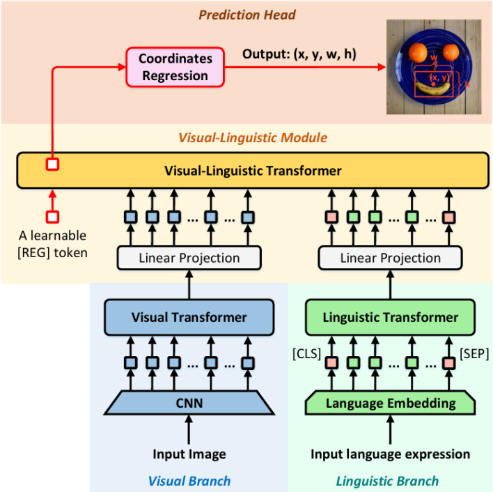
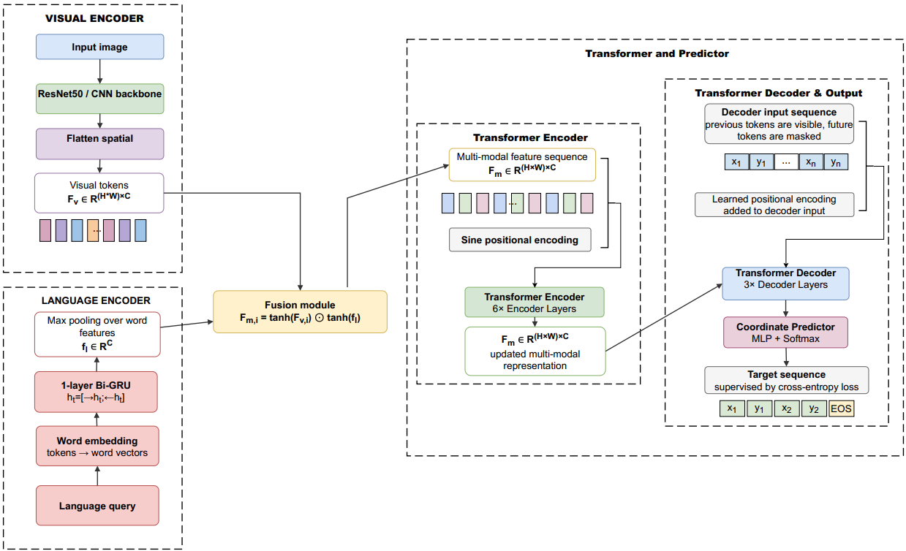

# Reimplementing TransVG and Improving Visual Grounding with Decoder-Inspired Sequential Coordinate Prediction

## 🔗 Introduction to Visual Grounding

Visual Grounding (also known as Referring Expression Comprehension) is a fundamental vision-language task that bridges human natural language with visual perception. Given an input image and a natural language expression query describing a specific object, the model must predict a bounding box $b = (x_1, y_1, x_2, y_2)$ that accurately localizes the top-left and bottom-right coordinates of the referred region.

Unlike standard object detection which detects all objects within predefined categories, Visual Grounding requires the model to deeply understand intra-modality and inter-modality context-such as attributes, action states, and complex spatial relationships encoded in human queries and establish a fine-grained alignment between visual and linguistic contexts. This capability makes it a critical foundation for advanced AI fields like human-computer interaction, robotic instruction following, and multimodal image retrieval systems.

---

## 🔗 Dataset: RefCOCO

Due to limited hardware resources, all experiments and evaluations in this project are conducted exclusively on the benchmark **RefCOCO** dataset with a reduced training schedule.

The samples in RefCOCO are officially partitioned into four distinct splits:

* **Train set:** 120,624 expressions used for optimization.

* **Validation set:** 10,834 expressions used for evaluation and ablation verification.

* **TestA set:** 5,657 expressions primarily containing person-related queries.

* **TestB set:** 5,095 expressions focusing on non-person objects, small targets, or visually ambiguous scenarios.

---

## 🔗 Baseline: TransVG Reimplementation

TransVG is an end-to-end, transformer-based visual grounding framework that formulates the task as a direct coordinate regression problem. It utilizes a visual branch (ResNet + Visual Transformer) and a linguistic branch (BERT) to extract multimodal features, combines them with a learnable `[REG]` token, and feeds them into a Visual-Linguistic Transformer stack. The output state of the `[REG]` token directly regresses the 4-dimensional bounding box coordinates using a combination of Smooth L1 Loss and GIoU Loss.

TransVG Architechture:

🔗 *You can view our standalone baseline reproduction code here:* **[TransVG-Reproduce-Repository](https://github.com/lmka05/TransVG_Reproduce)**

---

## 🔗 Proposed Architecture: Decoder-Inspired Improvement

To address TransVG's limitations under constrained training schedules and heavy pre-trained parameters, we introduce two core improvements inspired by sequence-to-sequence generation networks:

1. **Lightweight Language Encoder:** We replace the heavy 12-layer pre-trained BERT module with a traditional 1-layer **Bidirectional Gated Recurrent Unit (Bi-GRU)**. Since referring expressions are typically short phrases, a recurrent encoder drastically cuts down parameter size while preserving complete contextual representations.

2. **Sequential Coordinate Prediction:** Instead of regressing continuous coordinates, we serialize and quantize the continuous bounding box into a sequence of discrete coordinate integer tokens using quantization bins. The continuous regression head is replaced with a 3-layer Transformer Decoder that predicts the coordinate token sequence $T = [x_1, y_1, x_2, y_2, \text{EOS}]$ autoregressively. This reformulates the training objective into a unified standard Cross-Entropy Loss.

Proposal Architechture:

---

## 🔗 Experimental Results

| Method | Backbone | Precision@0.5 (Val) | Precision@0.5 (TestA) | Precision@0.5 (TestB) | Notes |
| --- | --- | --- | --- | --- | --- |
| Original TransVG (90 epochs) | ResNet-50 | 80.32 | 82.67 | 78.12 | Reported/official result from the original paper. |
| Reimplemented TransVG (30 epochs) | ResNet-50 | 46.58 | 51.32 | 39.23 | Our reproduced baseline under limited hardware resources. |
| Proposed Method (30 epochs) | ResNet-50 | 74.65 | 79.32 | 67.67 | Our proposed method. |

> 🔗 Notably, despite being trained for only 30 epochs, our proposed method yields performance that closely approaches the original TransVG framework fully trained for 90 epochs, highlighting its high learning efficiency under tight resource constraints.
> 
>

---

## 🔗 More Details

For comprehensive architectural breakdowns, hyperparameter tuning logs, detailed loss curve diagrams, qualitative grounding predictions, and complete mathematical derivations, please read our full project paper:

🔗 **[Read the Full Academic Report (Report.pdf)](Report/Report.pdf)**

---